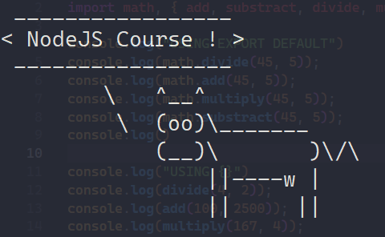

## NodeJS Course 🥇



### Algunas preguntas 🚀
- ¿Qué es NODE?
  - Node es literalmente un entorno de ejecución de JavaScript, lo que quiere decir esque es **un sitio donde puedes ejecutar JavaScript**.
- ¿Porqué aprender NODE?
  - La demanda del mercado (hay un montón de cosas que están utilizando NODE)
  - El stack, ya sea MEAN (MongoDB, Express, Angular, Node) o MERN (MongoDB, Express, React, Node), utilizando Node.
  - Puedes utilzar todo tu conocimiento de JavaScript en NODE.
  - Puedes crear aplicaciones web, APIs, CLI, Scrapping, Servicios, Utilidades.
  - Una comunidad inmensa y un ecosistema de paquetes NPM, el cual es el más grande del mundo.
  - Es rápido, escalable, y fácil de desplejar.

### Un poco de historia 🚀
Node nació en el año 2009, por Ryan Doll, y lo creo por las limitaciones que tenía Apache HTTP Server, que no era capaz de manejar muchas conexiones a la vez.

### Requisitos 🚀
- Saber javascript.
- ECMA script modules (opcional).
 
### Instalar Node 🚀
Lo recomendable es utilizar la versión LTS, ya que esta versión es la recomendada para la mayoría, es la que están actualizando y la que tiene más soporte. En cambio la actual tiene las ultimas características, pero no es la más estable.

- Forma oficial [https://nodejs.org/en](https://nodejs.org/en)
  - Si lo hacemos de la forma oficial bajando un instalar de la página oficial lo que vamos a instalar va ser una vez Node, es decir que nos va instalar una versión de Node en todo nuestro sistema operativo. Y en realidad lo que queremos muchas veces es tener distintas versiones de Node, porque vamos a tener distintos projectos. Una opción puede ser Dockerizar las aplicaciones pero esto es mucho lio. Entonces lo mejor que podemos hacer es utilizar un **administrador de versiones de Node**.

- Forma no oficial
  - Y el más conocido es **nvm**, pero nosotros vamos a utlizar la siguiente [https://github.com/Schniz/fnm](https://github.com/Schniz/fnm), esta escrito en Rust, y lo instalaremos rápido. Así que instalamos fnm, y luego Rust [https://rust-lang.org/es](https://rust-lang.org/es)
  - Okey, ahora vamos a comprobar la versión de fnm
    ```bash
    fnm --version
    ```
  - Ahora, podemos listar las versiones que tengamos instaladas de Node, **vamos a instalar la 18**.
    ```bash
    fnm install 18.17.0
    fnm list
    ```
  - Y ahora, le decimos que vamos a utilizar la versión 18.17.0
    ```bash
    fnm use 18.17.0
    ```
  - Okey y ahora comprobamos la versión utilizando Node
    ```bash
    node --version
    ```
  - Y para colocarla por defecto
    ```bash
    fnm alias 18.17.0 default
    fnm list
    ```